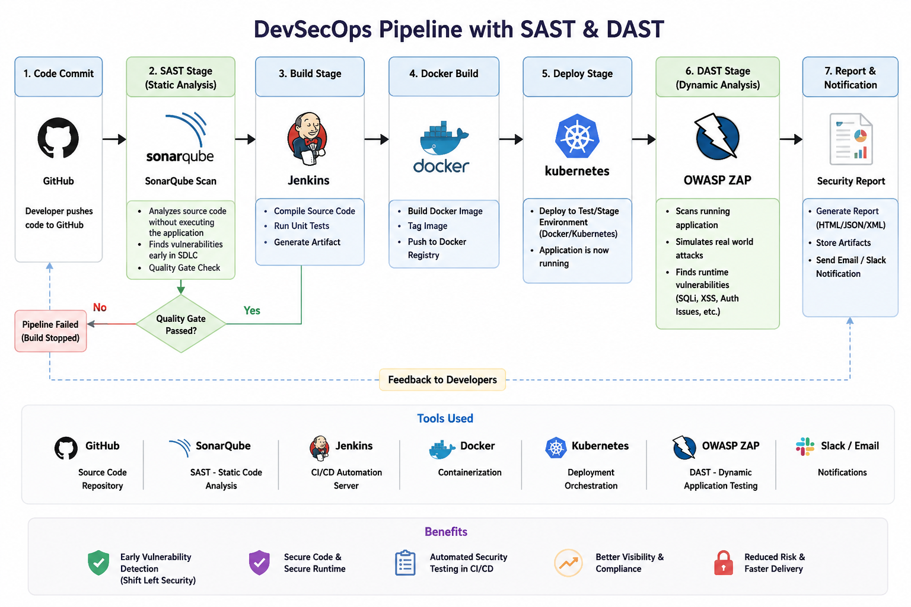

# DevSecOps Pipeline with SAST & DAST

## Overview

This project demonstrates a complete DevSecOps CI/CD pipeline integrating both SAST (Static Application Security Testing) and DAST (Dynamic Application Security Testing) to improve application security throughout the software development lifecycle.

The pipeline uses Jenkins, SonarQube, Docker, Trivy, OWASP ZAP, GitHub, and Kubernetes to automate code analysis, container security scanning, deployment, and runtime security testing.

---
# DevSecOps Pipeline with SAST & DAST



# DevSecOps Pipeline Flow

```text
GitHub
   ↓
Jenkins
   ↓
SAST (SonarQube)
   ↓
Build Application
   ↓
Docker Image Build
   ↓
Trivy Image Scan
   ↓
Push Image to Docker Hub
   ↓
Deploy Application
   ↓
DAST (OWASP ZAP)
   ↓
Security Report
```

---

# SAST (Static Application Security Testing)

SAST is used to scan application source code before deployment. It does not require the application to be running.

## How It Works

1. Developers push code to GitHub.
2. Jenkins checks out the source code.
3. SonarQube scans the codebase.
4. Security vulnerabilities and code quality issues are identified.
5. If the Quality Gate fails, the pipeline stops.

## Issues Detected by SAST

* Hardcoded passwords
* Hardcoded API keys
* SQL Injection vulnerabilities
* Insecure coding practices
* Code smells
* Security hotspots
* Weak exception handling

## Tool Used

* SonarQube

## Benefits

* Early vulnerability detection
* Shift-left security approach
* Improved code quality
* Reduced remediation costs

---

# DAST (Dynamic Application Security Testing)

DAST is performed after the application is deployed and running.

Unlike SAST, DAST tests the application externally by simulating real-world attacks.

## How It Works

1. Application is built and deployed.
2. A live application URL becomes available.
3. OWASP ZAP scans the running application.
4. Security vulnerabilities are identified.
5. Reports are generated.
6. Pipeline can be configured to fail on critical findings.

## Issues Detected by DAST

* Cross-Site Scripting (XSS)
* SQL Injection
* Authentication weaknesses
* Missing security headers
* Insecure cookies
* CORS misconfigurations
* Exposed endpoints
* Runtime vulnerabilities

## 💡 Simple Example:

DAST will try:

' OR 1=1 --

If login bypass happens → vulnerability is detected.

## Tool Used

* OWASP ZAP

## Benefits

* Tests real application behavior
* Detects runtime vulnerabilities
* Simulates attacker activity
* Improves production security posture

---

# Pipeline Stages

## 1. Git Checkout

* Developer pushes code to GitHub.
* Jenkins clones the repository.

## 2. SonarQube Scan (SAST)

* Source code security analysis.
* Quality Gate validation.
* Pipeline fails if critical issues are detected.

## 3. Build Stage

* Maven builds the application.
* Generates deployable artifact.

## 4. Docker Build

* Creates Docker image.
* Tags image with Jenkins build number.

## 5. Trivy Image Scan

* Scans Docker image for vulnerabilities.
* Detects CVEs and security risks.

## 6. Push Image to Docker Hub

* Authenticates with Docker Hub.
* Pushes scanned image.

## 7. Deploy Application

* Deploys application to Docker, Kubernetes, or EKS.

## 8. DAST Scan using OWASP ZAP

* Scans running application.
* Performs dynamic security testing.
* Generates security reports.

## 9. Report & Notifications

* Security reports archived.
* Notifications sent through Email or Slack.

---

# SAST vs DAST

| Feature                      | SAST              | DAST                |
| ---------------------------- | ----------------- | ------------------- |
| Type                         | Static            | Dynamic             |
| Stage                        | Before Deployment | After Deployment    |
| Access                       | Source Code       | Running Application |
| Testing Style                | White Box         | Black Box           |
| Speed                        | Fast              | Slower              |
| Finds                        | Code-Level Issues | Runtime Issues      |
| Requires Running Application | No                | Yes                 |

---

# Key Interview Point

> SAST analyzes source code for vulnerabilities before execution, while DAST tests a running application by simulating real-world attacks from the outside.

---

# Best Practices

* Use SAST early in the CI/CD pipeline.
* Use DAST after deployment to staging environments.
* Integrate Trivy for container security scanning.
* Fail the pipeline on critical vulnerabilities.
* Generate security reports for compliance and auditing.
* Combine SAST and DAST for complete application security coverage.

---

# OWASP ZAP Installation on Amazon Linux

## Option 1: Run OWASP ZAP Using Docker (Recommended)

Verify Docker:

```bash
docker --version
```

Pull OWASP ZAP Image:

```bash
docker pull ghcr.io/zaproxy/zaproxy:stable
```

Verify Installation:

```bash
docker run --rm ghcr.io/zaproxy/zaproxy:stable zap.sh -version
```

---

## Option 2: Install OWASP ZAP Directly

Install Java:

```bash
sudo dnf install java-17-amazon-corretto -y
```

Verify Java:

```bash
java -version
```

Download OWASP ZAP:

```bash
wget https://github.com/zaproxy/zaproxy/releases/latest/download/ZAP_2_16_1_unix.sh
```

Make Installer Executable:

```bash
chmod +x ZAP_2_16_1_unix.sh
```

Install ZAP:

```bash
./ZAP_2_16_1_unix.sh
```

Verify Installation:

```bash
/opt/ZAP_2.16.1/zap.sh -version
```

---

# Technologies Used

* GitHub
* Jenkins
* Maven
* SonarQube
* Docker
* Trivy
* Docker Hub
* Kubernetes / Amazon EKS
* OWASP ZAP

---

# Security Benefits

* Shift-Left Security
* Automated Security Testing
* Continuous Vulnerability Assessment
* Secure CI/CD Pipeline
* Faster Remediation
* Improved Compliance
* Reduced Security Risks
